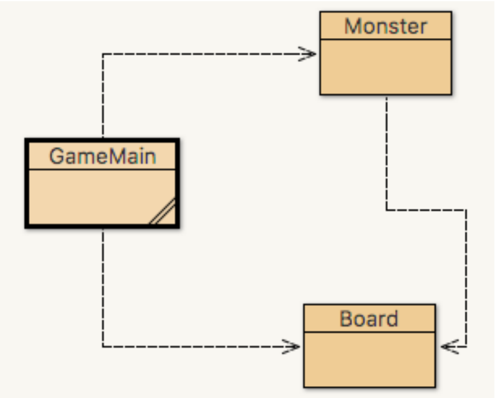

Monster Game
===============================================================================
Overview
-------------------------------------------------------------------------------

This way was an assignment given for the **CO518: Algorithms, Correctness and Efficiency** module. The main objective was to write an efficient algorithm to launch a monster attack using linear data structures types and following certain constraints.

- [Launch attack algorithm Documentation ](./Documentation/README.md)
- [Launch attack algorithm method ](https://github.com/U-ways/Monster-Game/blob/7177d925148a807d7fe02e8133a448db7d5de700/src/main/java/app/monster_game/Board.java#L154)


Assignment description
-------------------------------------------------------------------------------

You have been tasked to develop a Monster Game that is set on a grid with rows and columns, as indicated below:

```
= = = = =
= * * * =
= * * * =
= * * * =
= = = = =
```

As seen in diagram 1, the grid is made up of a hedge (`=`) that surrounds the stars (`*`). The aim of the game is to place monsters onto the grid by replacing the star (`*`) with the first letter of a monster’s name. No monster can be placed on a hedge (`=`).

Monsters can attack each other in turn within their cardinal directions only (North, West, South, East). So If there were monsters placed in the grid:

```
= = = = =
= A * * =
= * B C =
= * D * =
= = = = =
```

Only `B`, `C` and `D` can attack each other. Whoever attacks first eliminates the rest. (You should be able to add more later monsters)

Whenever a monsters eliminates another, increase their score by 1.

#### UML digram to follow:

You're tasked to develop the program given the following UML guidelines:




#### Objective:

Find an efficient algorithm to attack and track monsters from/using the `Board` Class while providing the following options:

1. Create a monster by name.
2. Launch an attack by name of the monster that wants to attack.
3. View the board.
4. Retrieve a score of a monster by name.
5. List the monsters alive.
6. Quit playing


Command list:
-------------------------------------------------------------------------------

| Command                | Description                     |
|:-----------------------|:--------------------------------|
| `1 {NEW_MONSTER_NAME}` | Enter a monster onto the board. |
| `2 {AGGRESSOR_NAME}`   | Launch an attack on a monster   |
| `3`                    | View the board                  |
| `4`                    | Retrieve a score of a monster   |
| `5`                    | List all players alive          |
| `6 or q`               | quit the game                   |

_______________________________________________________________________________
